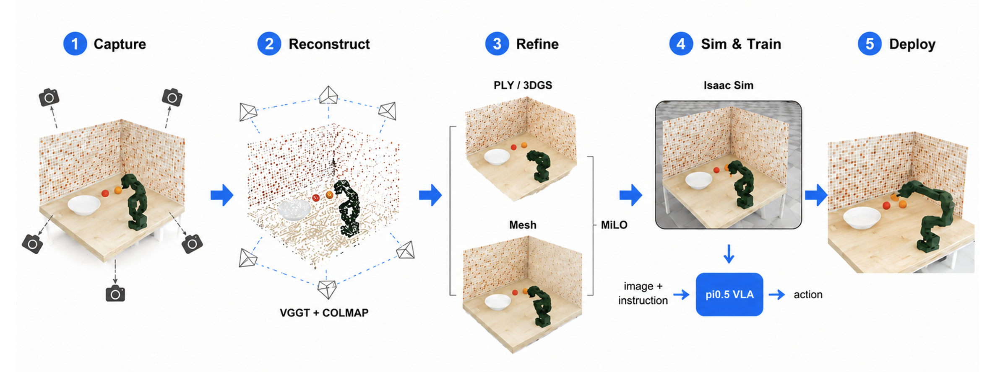
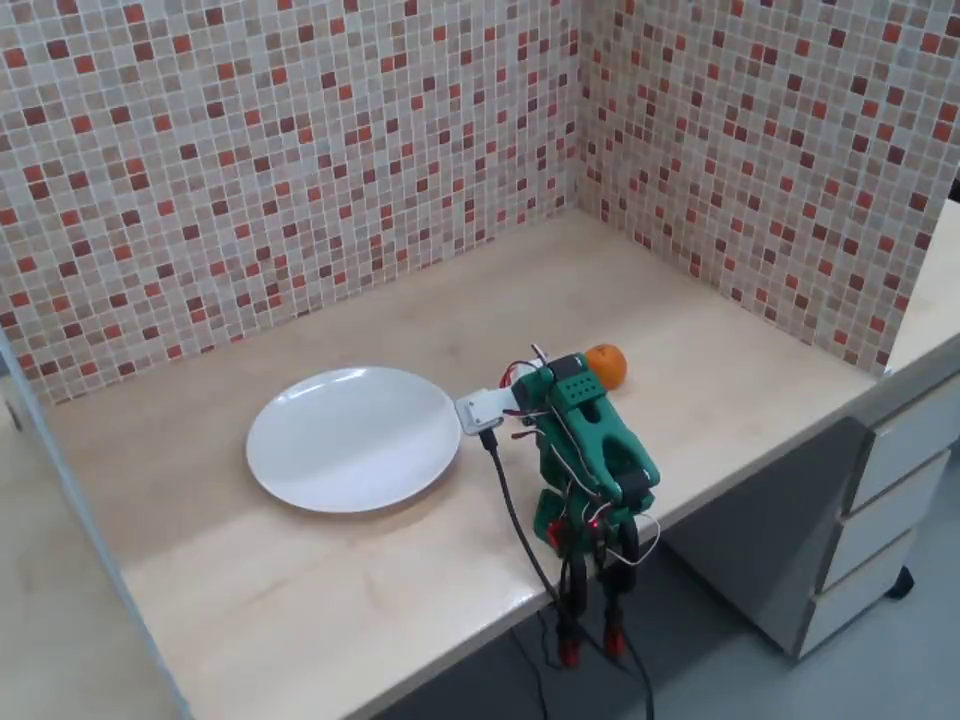
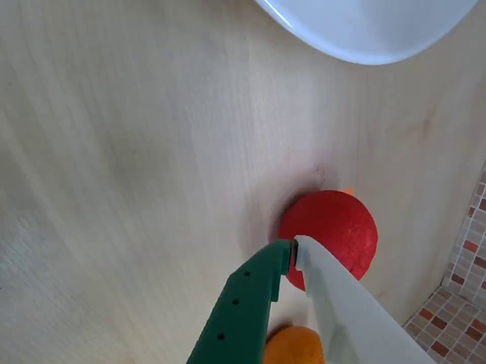
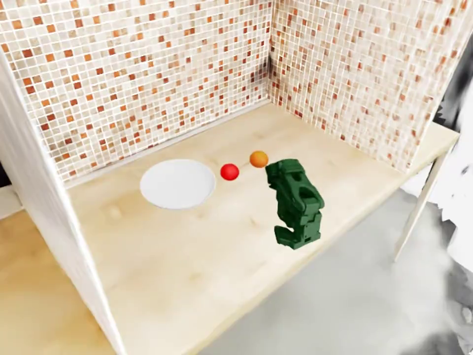

# Recon2Act:  3D Reconstruction for Sim-to-Real VLA Learning

**Recon2Act** is a real-to-sim-to-real robotics pipeline for adapting vision-language-action (VLA) policies to a target manipulation workspace.
The project reconstructs a real tabletop scene into a simulation-ready digital twin, generates robot demonstrations in Isaac Sim, fine-tunes a VLA policy, and evaluates the trained policy in both simulation and the real world.

This project is built on top of the **LeIsaac** workflow, which provides IsaacLab-based teleoperation, data collection, conversion to the LeRobot Dataset format, and policy training/deployment utilities.

---

## Overview

The goal of this project is to reduce the gap between simulation-based VLA training and real-world robot deployment.

Instead of training in a generic simulation scene, we first reconstruct the target real workspace and use the reconstructed scene as a digital twin for simulation-based data generation.

<p align="center">
  
</p>

The overall pipeline consists of:

1. **Real Scene Capture**
   Capture the target tabletop workspace from multiple camera viewpoints.

2. **3D Reconstruction**
   Reconstruct the scene geometry using **VGGT** and **COLMAP**.

3. **Scene Refinement**
   Refine the reconstructed representation using **MiLO** and generate PLY / 3DGS / mesh assets.

4. **Digital Twin in Isaac Sim**
   Import the reconstructed scene into Isaac Sim and align the robot, table, objects, and camera views.

5. **VLA Fine-tuning and Deployment**
   Generate simulated demonstrations, fine-tune a `pi0.5`-based VLA policy, and deploy the trained policy in the real workspace.

---

## Dataset Visualization

We visualize both real-world and simulation-collected LeRobot datasets using the official LeRobot dataset visualizer.

| Dataset                |    Episode | Link                                                                                                                                               |
| ---------------------- | ---------: | -------------------------------------------------------------------------------------------------------------------------------------------------- |
| Real-world orange task |  episode 0 | [Open in LeRobot Visualizer](https://huggingface.co/spaces/lerobot/visualize_dataset?path=%2Fseunghoney%2Freal-orange_20260619_235723%2Fepisode_0) |
| Simulation orange task | episode 11 | [Open in LeRobot Visualizer](https://huggingface.co/spaces/lerobot/visualize_dataset?path=%2Fseunghoney%2Forange%2Fepisode_11)                     |

---

## Camera Views

The policy uses both **front camera** and **wrist camera** observations.

### Real-world Dataset

| Front Camera | Wrist Camera |
|---|---|
| [](docs/assets/real_front.mp4) | [](docs/assets/real_wrist.mp4) |

### Simulation Dataset

| Front Camera | Wrist Camera |
|---|---|
| [](docs/assets/sim_front.mp4) | [](docs/assets/sim_wrist.mp4) |

If GitHub does not render the videos directly in the table, use the links below:

* [Real front camera](docs/assets/real_front.mp4)
* [Real wrist camera](docs/assets/real_wrist.mp4)
* [Simulation front camera](docs/assets/sim_front.mp4)
* [Simulation wrist camera](docs/assets/sim_wrist.mp4)

---

## Repository Structure

```text
Recon2Act/
├── assets/                 # Figures, videos, and README media
├── docs/                   # Additional documentation
├── scripts/                # Training, evaluation, and utility scripts
├── source/leisaac/         # LeIsaac-based simulation and data pipeline
├── tools/                  # Reconstruction / conversion tools
├── *.usd                   # Isaac Sim scene and robot assets
├── train.sh                # Training entry script
├── eval.sh                 # Real-world evaluation script
├── eval_simul.sh           # Simulation evaluation script
└── README.md
```

---

## Method

### 1. Real Scene Capture

We construct a tabletop manipulation workspace and capture multi-view RGB images.
The workspace contains a robot arm, a table, target objects, and background structures such as wall panels.

### 2. 3D Scene Reconstruction

The captured images are processed with VGGT and COLMAP to estimate camera poses and reconstruct the scene geometry.

The output includes:

* Camera poses
* Sparse / dense point cloud
* PLY assets
* Initial scene geometry

### 3. MiLO-Based Refinement

The reconstructed scene is refined using MiLO to obtain cleaner geometry and mesh-like representations suitable for simulation.

The refined outputs are used to build a digital twin of the real workspace.

### 4. Isaac Sim Digital Twin

The reconstructed scene is imported into Isaac Sim.
The robot, table, object poses, camera views, and workspace geometry are aligned with the real-world setup.

This simulation environment is used to generate demonstration data for policy learning.

### 5. VLA Fine-tuning

We fine-tune a `pi0.5`-based VLA policy using simulated demonstrations collected in the reconstructed digital twin.

The policy receives:

* Front camera image
* Wrist camera image
* Language instruction

and predicts robot actions for the manipulation task.

### 6. Real-World Deployment

Finally, the fine-tuned policy is deployed in the real tabletop workspace.
We compare simulation behavior and real-world execution to analyze the remaining sim-to-real gap.

---

## Observations

Simulation training in the reconstructed digital twin provides a practical way to generate task demonstrations without repeatedly collecting real robot data.

However, real-world deployment remains challenging. We observed several failure factors:

* Remaining visual and physical sim-to-real gap
* Limited generalization capability of the current `pi0.5` VLA policy
* Joint-level error accumulation in the LeRobot execution pipeline
* Sensitivity to camera viewpoint, object pose, and robot calibration mismatch

These results suggest that digital-twin-based VLA fine-tuning is promising, but robust real-world deployment still requires better calibration, improved controller accuracy, and stronger policy adaptation.

---

## Acknowledgement

This project is built upon the **LeIsaac** framework and the **LeRobot** ecosystem.
We use LeIsaac-style IsaacLab simulation, LeRobot dataset formatting, and camera-based robot policy training utilities as the base of our sim-to-real VLA pipeline.

---

## Project Page

* GitHub: https://github.com/c0zyb1ue/Recon2Act
* Real dataset visualization: https://huggingface.co/spaces/lerobot/visualize_dataset?path=%2Fseunghoney%2Freal-orange_20260619_235723%2Fepisode_0
* Simulation dataset visualization: https://huggingface.co/spaces/lerobot/visualize_dataset?path=%2Fseunghoney%2Forange%2Fepisode_11

