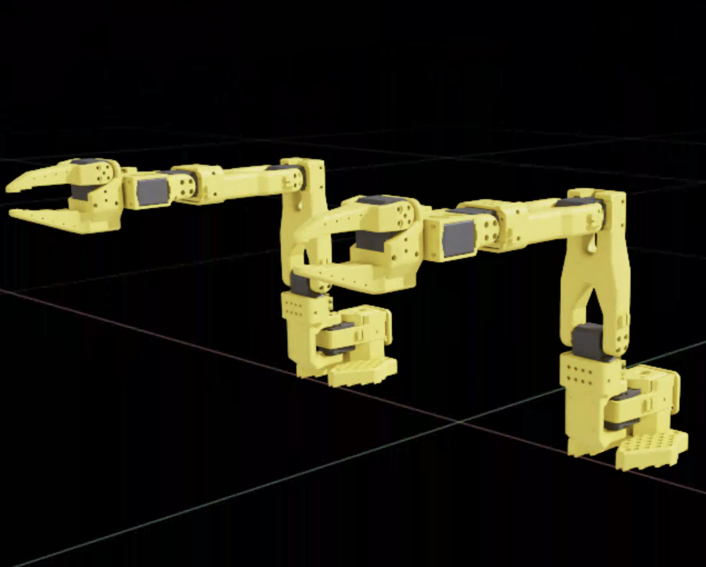

# LeIsaac

<p align="center">
  
</p>

<p align="center">
  <a href="https://lightwheelai.github.io/leisaac/">Documentation</a> |
  <a href="https://lightwheelai.github.io/leisaac/docs/getting_started/installation">Installation</a> |
  <a href="https://lightwheelai.github.io/leisaac/docs/getting_started/teleoperation">Teleoperation</a> |
  <a href="https://lightwheelai.github.io/leisaac/resources/available_env">Environments</a> |
  <a href="https://github.com/LightwheelAI/leisaac">Original Repository</a>
</p>

LeIsaac provides teleoperation and imitation-learning workflows in
[IsaacLab](https://isaac-sim.github.io/IsaacLab/main/index.html) for
[LeRobot](https://github.com/huggingface/lerobot)-style robots. It supports
simulation teleoperation, data collection, dataset conversion, scripted data
generation, policy training, and policy evaluation.

https://github.com/user-attachments/assets/763acf27-d9a9-4163-8651-3ba0a6a185d7

## What LeIsaac Provides

- IsaacLab environments for SO101 Follower, Bi-Arm SO101 Follower, LeKiwi, and related LeRobot robots.
- Teleoperation with SO101 Leader, Bi-SO101 Leader, keyboard, gamepad, and remote ZMQ-based control.
- Recording pipelines for HDF5 and LeRobot Dataset formats.
- State-machine data generation for programmatic trajectory collection.
- Policy inference support for GR00T N1.5, GR00T N1.6, LeRobot policies, and OpenPI.
- GitHub Pages documentation powered by Docusaurus: https://lightwheelai.github.io/leisaac/

## Visual Overview

| Custom task simulation | Custom scene asset | Teleoperation target frame |
| :---: | :---: | :---: |
|  |  |  |

| Single-Arm SO101 | Bi-Arm SO101 | LeKiwi |
| :---: | :---: | :---: |
|  |  |  |

## Task Videos

**Pick Orange**

https://github.com/user-attachments/assets/466eddff-f720-4f99-94d5-5e123e4c302c

**Lift Cube**

https://github.com/user-attachments/assets/1e4eb83a-0b38-40fb-a0b2-ddb0fe201e6d

**Clean Toy Table**

https://github.com/user-attachments/assets/e49d8f1c-dcc9-412b-a88f-100680d8a45b

**Fold Cloth**

https://github.com/user-attachments/assets/e29a0f8a-9286-4ce6-b45d-342c3d3ba754

**LeKiwi Cleanup Trash**

https://github.com/user-attachments/assets/b95baf5c-861d-4698-ab55-f929b271dab9

## Workflow

1. Install LeIsaac and IsaacLab dependencies.
2. Prepare robot and scene assets under `assets/`.
3. Run teleoperation or scripted data generation in IsaacLab.
4. Record data as HDF5 or directly as a LeRobot Dataset.
5. Convert, train, and evaluate policies in simulation or on hardware.

Start from the documentation:

- [Installation and setup](https://lightwheelai.github.io/leisaac/docs/getting_started/installation)
- [Teleoperation](https://lightwheelai.github.io/leisaac/docs/getting_started/teleoperation)
- [Dataset replay](https://lightwheelai.github.io/leisaac/docs/getting_started/dataset_replay)
- [Policy training and inference](https://lightwheelai.github.io/leisaac/docs/getting_started/policy_support)

## Quick Teleoperation Example

```bash
python scripts/environments/teleoperation/teleop_se3_agent.py \
    --task=LeIsaac-SO101-PickOrange-v0 \
    --teleop_device=so101leader \
    --port=/dev/ttyACM0 \
    --num_envs=1 \
    --device=cuda \
    --enable_cameras \
    --record \
    --dataset_file=./datasets/dataset.hdf5
```

More examples are available in the
[teleoperation guide](https://lightwheelai.github.io/leisaac/docs/getting_started/teleoperation).

## Supported Resources

| Resource | Link |
| :--- | :--- |
| Robots | [Available Robots](https://lightwheelai.github.io/leisaac/resources/available_robots) |
| Environments | [Available Environments](https://lightwheelai.github.io/leisaac/resources/available_env) |
| Devices | [Available Devices](https://lightwheelai.github.io/leisaac/resources/available_devices) |
| Policies | [Available Policy Inference](https://lightwheelai.github.io/leisaac/resources/available_policy) |
| Extra features | [Digital twin, MimicGen, EnvHub, LeRobot recorder, state-machine generation](https://lightwheelai.github.io/leisaac/docs/features) |

## News

- [2026-04-14] Remote teleoperation is now available in LeIsaac. Try it in the [teleoperation guide](https://lightwheelai.github.io/leisaac/docs/getting_started/teleoperation#remote-teleoperation).
- [2026-03-10] The new `datagen` module can generate motion trajectories programmatically. See [State Machine Data Generation](https://lightwheelai.github.io/leisaac/docs/features/state_machine).
- [2026-01-16] Added inference support for GR00T N1.6. Details are in [Available Policy Inference](https://lightwheelai.github.io/leisaac/resources/available_policy#finetuned-gr00t-n16).
- [2026-01-13] Try [LeIsaac x Cosmos](https://lightwheelai.github.io/leisaac/docs/tutorials/cosmos_tutorial) for a video-to-action data generation pipeline.
- [2026-01-12] [LeRobot recorder integration](https://lightwheelai.github.io/leisaac/docs/features/lerobot_recorder) can record data directly in LeRobot Dataset format during teleoperation.
- [2025-12-19] [LeIsaac x Marble](https://lightwheelai.github.io/leisaac/docs/tutorials/marble_tutorial) supports building and evaluating diverse embodied tasks across large-scale generalized environments.
- [2025-12-19] LeKiwi-based teleoperation and a Loft scene are available. See [Available Environments](https://lightwheelai.github.io/leisaac/resources/available_env).
- [2025-11-27] More teleoperation devices are supported, including enhanced keyboard and gamepad control. See [Available Devices](https://lightwheelai.github.io/leisaac/resources/available_devices).
- [2025-11-26] LeIsaac is the official imitation-learning simulation playground integrated into LeRobot EnvHub. See [LeIsaac x LeRobot EnvHub](https://huggingface.co/docs/lerobot/en/envhub_leisaac).

## Community

Welcome to the Lightwheel open-source community. For questions or collaboration,
contact [Zeyu](mailto:zeyu.hu@lightwheel.ai) or
[Yinghao](mailto:yinghao.shuai@lightwheel.ai).

## Contributing

Please see [CONTRIBUTING.md](CONTRIBUTING.md) for how to report issues and submit pull requests.

## Citation

If you use LeIsaac, please cite it as follows.

```txt
@software{Lightwheel_and_LeIsaac_Project_Developers_LeIsaac_2025,
author = {{Lightwheel} and {LeIsaac Project Developers}},
license = {Apache-2.0},
month = dec,
title = {{LeIsaac}},
url = {https://github.com/LightwheelAI/leisaac},
version = {0.4.0},
year = {2026}
}
```

## Acknowledgements

We gratefully acknowledge [IsaacLab](https://github.com/isaac-sim/IsaacLab) and
[LeRobot](https://github.com/huggingface/lerobot) for their excellent work, from
which LeIsaac borrows some code.

## Join Our Team

Lightwheel AI is looking for people interested in robotics engineering, AI/ML
research, robotics software, and applied research.

[Apply](https://lightwheel.ai/career) |
[Contact](mailto:zeyu.hu@lightwheel.ai) |
[Learn more](https://lightwheel.ai)
